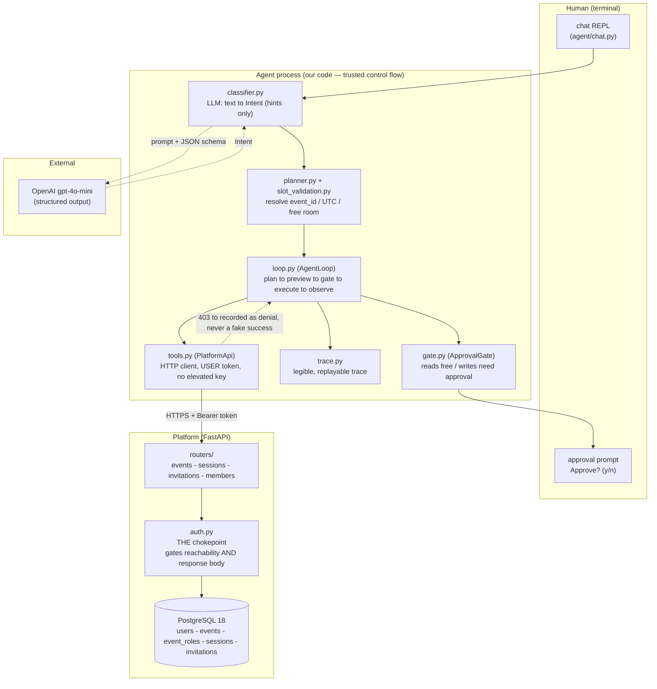
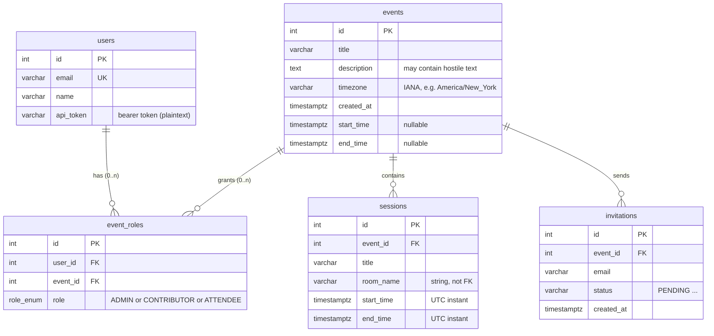

# Architecture & Data Model

The scaffold for the interview: what the components are, how a request flows,
and the data model.

Main Components:

1. **The platform** (FastAPI + PostgreSQL) — a normal CRUD API behind one
   data-driven authorization chokepoint.
2. **The agent** — a thin text client that drives the platform **only** over
   that public API, as the *user's own token*, with a human approval gate that
   lives in *our* code (not the model's prompt).

The single most important line on this page: **the LLM understands; code
resolves and executes.** Everything else follows from drawing the trust
boundary there.

---

## 1. Component diagram



**Read it as two trust zones.** Everything in the *Agent* box is code we wrote
and control. The *model* only ever hands back a structured `Intent` (a hint
like `{"action": "create_session", "slots": {"when": "next Tuesday at 9am"}}`);
it never holds the token, never calls the API, and never decides whether a write
lands.

### Plain-ASCII fallback (if mermaid doesn't render)

```
   HUMAN
     |  "schedule a 45-min design review next Tuesday at 9am ..."
     v
 +--------------------------- AGENT (code) ---------------------------+
 |  classifier --(Intent hint)--> planner/resolver --> loop.py            |
 |      ^                                                |  |  |          |
 |      | prompt/JSON                          preview --+  |  +-- trace   |
 |      v                                                    v              |
 |  [OpenAI gpt-4o-mini]                              gate.py --> HUMAN   |
 |  (structured output)                               (Approve? y/n)       |
 |                                                          |              |
 |                              tools.py (USER token) <-----+              |
 +----------------------------------|-------------------------------------+
                                    | HTTPS + Bearer <user token>
                                    v
 +-------------------------- PLATFORM (FastAPI) --------------------------+
 |   routers/  -->  auth.py  -->  PostgreSQL 18                           |
 |                 (chokepoint: gates which routes AND the response body)  |
 +-------------------------------------------------------------------------+
```

---

## 2. Data model

Five tables. `event_roles` is the heart of authorization — roles are **per-event**,
so the same user can be ADMIN on one event and ATTENDEE on another.



### ASCII fallback

```
 users                 event_roles (PER-EVENT roles)          events
 +--------------+      +--------------------------+          +--------------------+
 | id        PK |--+   | id              PK       |      +---| id             PK  |
 | email     UK |  +-->| user_id         FK ------+------+   | title              |
 | name         |      | event_id        FK ------+          | description (hostile?)|
 | api_token    |      | role  role_enum          |          | timezone (IANA)    |
 +--------------+      |  ADMIN|CONTRIBUTOR|ATTENDEE|        | start_time/end_time|
                       |  UNIQUE(user_id,event_id) |        | created_at         |
                       +--------------------------+          +---------+----------+
                                                                       |
                            +------------------------------------------+
                            v                                          v
                     sessions                                  invitations (50k+)
              +--------------------------+              +--------------------------+
              | id             PK        |              | id             PK        |
              | event_id       FK        |              | event_id       FK        |
              | title                    |              | email                    |
              | room_name  (string)      |              | status (PENDING ...)     |
              | start_time  TIMESTAMPTZ  |              | created_at               |
              | end_time    TIMESTAMPTZ  |              | UNIQUE(event_id,email)   |
              | CHECK(end > start)       |              | idx(event_id, id)        |
              +--------------------------+              +--------------------------+
```


---